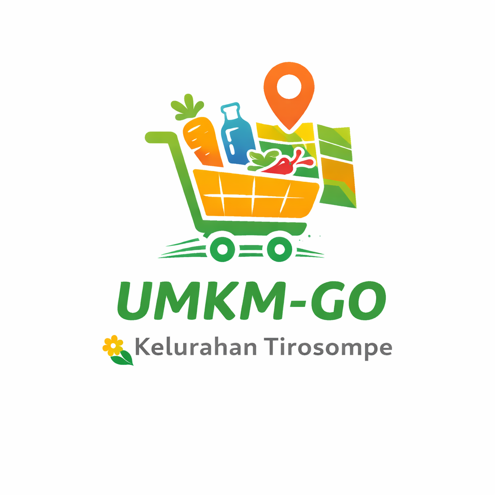

# UMKM-GO Platform

<div align="center">



**Platform Digitalisasi UMKM Kelurahan Tirosompe, Kota Parepare**

[](https://nextjs.org/)
[](https://reactjs.org/)
[](https://www.typescriptlang.org/)
[](https://tailwindcss.com/)
[](https://supabase.com/)

[Live Demo](https://umkm-go-tirosompe.vercel.app)

</div>

---

## 📖 Tentang Proyek

UMKM-GO adalah Progressive Web Application (PWA) yang dikembangkan untuk mendigitalisasi dan mempromosikan UMKM (Usaha Mikro, Kecil, dan Menengah) di Kelurahan Tirosompe, Kota Parepare. Platform ini memudahkan pelaku UMKM untuk memamerkan produk mereka secara online dan memungkinkan konsumen untuk menjelajahi serta memesan produk lokal dengan mudah.

### 🎯 Tujuan

- Meningkatkan visibilitas UMKM lokal melalui platform digital
- Memudahkan konsumen menemukan dan memesan produk UMKM
- Menyediakan katalog produk yang terstruktur dan mudah diakses
- Mendukung ekonomi lokal Kelurahan Tirosompe

### ✨ Fitur Utama

- 📱 **Progressive Web App (PWA)** - Install sebagai aplikasi native
- 🛍️ **Katalog UMKM & Produk** - Tampilan yang menarik dan informatif
- 💬 **Integrasi WhatsApp** - Pemesanan langsung via WhatsApp
- 🎨 **Dual Order System**:
  - Catalog Order: Keranjang belanja dengan form pemesanan
  - WhatsApp Only: Direct chat untuk produk custom
- 👨‍💼 **Admin Dashboard** - CRUD management untuk UMKM dan produk
- ⚡ **Performance** - Server-side rendering, image optimization
- 📊 **Real-time Statistics** - Total UMKM, produk, dan kategori

---

## 🚀 Tech Stack

### Frontend
- **Next.js 16.1.4** 
- **React 19.2.3** 
- **TypeScript 5** 
- **Tailwind CSS 4** 
- **Lucide React**
- **React Hot Toast**

### Backend & Database
- **Supabase** 
- **@supabase/ssr**

### PWA & Performance
- **next-pwa 5.6.0**
- **nprogress**

### Deployment
- **Vercel** 

---

## 📦 Installation

### Prerequisites

- Node.js 20.x atau lebih baru
- npm atau yarn
- Akun Supabase

### Setup Steps

1. **Clone repository**
   ```bash
   git clone https://github.com/yourusername/umkm-go.git
   cd umkm-go
   ```

2. **Install dependencies**
   ```bash
   npm install
   # atau
   yarn install
   ```

3. **Setup environment variables**
   
   Buat file `.env.local` di root folder:
   ```env
   NEXT_PUBLIC_SUPABASE_URL=your_supabase_project_url
   NEXT_PUBLIC_SUPABASE_ANON_KEY=your_supabase_anon_key
   ```

4. **Setup database**
   
   Jalankan SQL schema di Supabase SQL Editor:
   ```sql
   -- Lihat file: /database/schema.sql
   ```

5. **Run development server**
   ```bash
   npm run dev
   # atau
   yarn dev
   ```

6. **Open browser**
   ```
   http://localhost:3000
   ```

---

## 📁 Project Structure

```
umkm-go/
├── app/                          # Next.js App Router
│   ├── layout.tsx               # Root layout
│   ├── page.tsx                 # Homepage
│   ├── globals.css              # Global styles
│   ├── umkm/
│   │   └── [id]/
│   │       ├── page.tsx         # UMKM detail
│   │       └── loading.tsx      # Loading state
│   ├── admin/
│   │   ├── dashboard/           # Admin dashboard
│   │   └── umkm/                # UMKM management
│   ├── sitemap.ts               # Dynamic sitemap
│   └── robots.ts                # SEO robots.txt
├── components/
│   ├── public/                  # Public components
│   ├── admin/                   # Admin components
│   ├── PWAInstallPrompt.tsx
│   ├── TopLoader.tsx
│   └── ToastProvider.tsx
├── lib/
│   └── supabase/
│       ├── server.ts            # Server Supabase client
│       └── client.ts            # Client Supabase client
├── types/
│   └── index.ts                 # TypeScript types
├── public/
│   ├── logo.png
│   ├── manifest.json
│   └── icons/
└── package.json
```

---

## 🗄️ Database Schema

```sql
-- UMKM (Main entity)
CREATE TABLE umkm (
  id SERIAL PRIMARY KEY,
  name VARCHAR(255) NOT NULL,
  category VARCHAR(100),
  description TEXT,
  address TEXT,
  whatsapp VARCHAR(20),
  opening_hours VARCHAR(255),
  order_type VARCHAR(50) DEFAULT 'catalog', -- 'catalog' | 'whatsapp_only'
  image_url TEXT,
  status VARCHAR(20) DEFAULT 'ACTIVE',
  created_at TIMESTAMP DEFAULT NOW(),
  updated_at TIMESTAMP DEFAULT NOW()
);

-- Products
CREATE TABLE products (
  id SERIAL PRIMARY KEY,
  umkm_id INTEGER REFERENCES umkm(id) ON DELETE CASCADE,
  name VARCHAR(255) NOT NULL,
  price DECIMAL(10, 2),
  description TEXT,
  image_url TEXT,
  status VARCHAR(20) DEFAULT 'AVAILABLE',
  created_at TIMESTAMP DEFAULT NOW(),
  updated_at TIMESTAMP DEFAULT NOW()
);
```
---

## 🎨 Features Deep Dive

### 1. Dual Order System

#### Catalog Order Type
- Customer bisa pilih produk dengan quantity
- Shopping cart terintegrasi
- Generate pesan WhatsApp otomatis dengan detail pesanan
- Cocok untuk: UMKM dengan produk tetap dan harga pasti

#### WhatsApp Only Type
- Produk ditampilkan sebagai katalog visual
- Direct contact via WhatsApp
- Cocok untuk: Produk custom, layanan, atau harga variatif

### 2. Progressive Web App (PWA)

- Install ke homescreen (Android & iOS)
- Offline-ready (coming soon)
- App-like experience
- Fast loading dengan service worker

### 3. SEO Optimization

- Dynamic metadata per page
- Open Graph tags untuk social sharing
- Automatic sitemap generation
- Robots.txt untuk search engines
- Server-side rendering (SSR)

### 4. Admin Dashboard

- Manage UMKM (Create, Read, Update, Delete)
- Manage Products per UMKM
- Upload images
- Toggle UMKM status (Active/Inactive)
- Real-time data update

---

## 🚀 Deployment

### Deploy ke Vercel (Recommended)

1. Push code ke GitHub
2. Import project di [Vercel](https://vercel.com)
3. Configure environment variables
4. Deploy!

### Environment Variables di Vercel

```env
NEXT_PUBLIC_SUPABASE_URL=https://xxx.supabase.co
NEXT_PUBLIC_SUPABASE_ANON_KEY=eyJhbGc...
```

### Build Command

```bash
npm run build
```

---

## 📱 Screenshots

<div align="center">

### Homepage


### UMKM Detail


### Admin Dashboard


### PWA Install


</div>

---

## 🛠️ Development

### Available Scripts

```bash
# Development
npm run dev          # Start dev server
npm run build        # Build for production
npm run start        # Start production server
npm run lint         # Run ESLint

# Type checking
npx tsc --noEmit     # Check TypeScript errors
```

### Code Style

- **TypeScript** untuk type safety
- **ESLint** untuk code quality
- **Prettier** (recommended) untuk formatting
- **Component naming**: PascalCase
- **File naming**: kebab-case

### Commit Convention

Gunakan conventional commits:

```
feat: add new feature
fix: bug fix
docs: documentation update
style: code formatting
refactor: code refactoring
test: add tests
chore: maintenance tasks
```

---

## 🤝 Contributing

Kontribusi sangat diterima! Ikuti langkah berikut:

1. Fork repository
2. Create feature branch (`git checkout -b feature/AmazingFeature`)
3. Commit changes (`git commit -m 'feat: add AmazingFeature'`)
4. Push to branch (`git push origin feature/AmazingFeature`)
5. Open Pull Request

### Contribution Guidelines

- Pastikan kode sudah di-test
- Update dokumentasi jika perlu
- Follow existing code style
- Tulis commit message yang jelas

---

## 🐛 Known Issues 

### Current Issues
- [ ] Image upload masih manual via Supabase dashboard
- [ ] No authentication untuk admin (basic check only)
- [ ] Limited error handling pada form submission

## 👥 Team

**Developer:** M Mirsa Bintang Muharram
**Institution:** Universitas Hasanuddin  
**Program:** KKN Tematik novasi Daerah Gelombang 115  
**Location:** Kelurahan Tirosompe, Kota Parepare

### Contact

- **Email:** mirsabintang0@gmail.xom
- **GitHub:** [@mirsabin22](https://github.com/mirsabin22)
- **LinkedIn:** [M Mirsa Bintang Muharram](https://www.linkedin.com/in/mmirsabintangmuharram/)

---

## 🙏 Acknowledgments

- **Kelurahan Tirosompe** - Untuk dukungan dan kerja sama
- **Universitas Hasanuddin** - KKN Tematik Gelombang 115
- **Pelaku UMKM Tirosompe** - Partisipasi dalam platform
---


<div align="center">

**Made with ❤️ for UMKM Tirosompe**

⭐ Star this repo if you find it helpful!

[⬆ Back to Top](#umkm-go-platform)

</div>